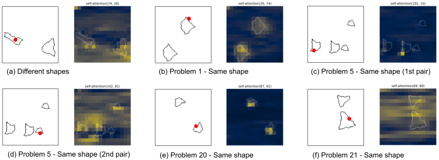
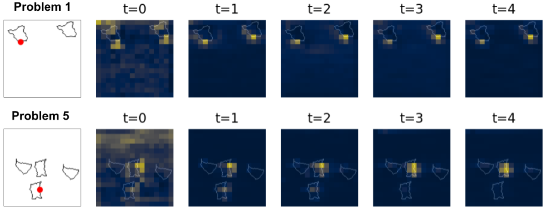

# Recurrent Vision Transformer for Visual Reasoning

This repo contains the code for reproducing the results in our paper *Recurrent Vision Transformer for Solving Visual Reasoning Problems*, accepted at ICIAP 2021 [preprint](https://arxiv.org/abs/2111.14576).

<table>
    <tr><td>Attention visualization:</td>
        <td align="center"></td></tr>
    <tr><td>Attention over timesteps:</td>
        <td align="center"></td></tr>
</table>
    
## Setup
Clone the repo and move into it:
```
git clone https://github.com/mesnico/recurrent_vision_transformer_visual_reasoning
cd recurrent_vision_transformer_visual_reasoning
```

Setup python environment using conda:
```
conda env create --file environment.yml
conda activate samedifferent
export PYTHONPATH=.
```

## Dataset
The dataset we used can be downloaded from [here](https://drive.google.com/drive/folders/1sseFn00q2PBbn1r_qTFnHv-4VCTgwnYQ?usp=sharing).
We generated the images with the code released by the authors of the SVRT dataset.

## Training
To train the RViT from-scratch, use the following command:
```
python run.py train --save_val_epochs 4.0 --model transformer_econvviut_hires_multiloss_medium --workers 8 --step_size 130 --epochs 160 --lr .0001 --data_path /path/to/dataset/results_problem_X --batch_size 64 --ngpus 1 --depth 0 --u-depth 9 --training_imgs 28000 --data-augmentation --output_path runs/experiment_name
```
Remember to change `/path/to/dataset/results_problem_X` with the path to the folder of the task (X=1,5,20,21) that you want to train the network with.
Opening a tensorboard at the path indicated by the argument `--output_path`, you can see the training and validation curves while training progresses.
To train the RViT with a pre-trained ResNet-50 as a backbone, simply use the `--pretrain` argument, with values:
- `resnet-2-8` &rarr; **ResNet-50/11** in the paper
- `resnet-3` &rarr; **ResNet-50/23** in the paper

Note that you can pass one of the following models to the `--model` argument:

- `transformer_econvviut_hires_multiloss_medium`  &rarr; **RViT large** in the paper
- `transformer_econvviut_hires_multiloss_small`  &rarr; **RViT small** in the paper

To train using 400k images instead of 28k, simply use the argument `--training_imgs 400000`

## Test
To test a trained model, issue the following command:
```
python run.py test_convergence --resume_path runs/experiment_name/best_checkpoint.pth.tar --training_problem X --workers 8 --data_path_validation /path/to/dataset --ngpus 1 --model transformer_econvviut_hires_multiloss_medium --depth 0 --u-depth 9 --data-augmentation
```
Change the `X` with the task id (1,5,20,21) with which the model was trained. You can also perform the test on a task different from the one with which the network was trained, to test how the network can generalize.
Also, make sure the `--model` argument is correct.

## Visualization
To view attention learned by the model, you can use the `visualize_attention.ipynb` notebook. You have to change the dataset and checkpoint paths accordingly.

## Citation
If you found this work useful for your research, please cite us:

    @article{messina2021recurrent,
      title={Recurrent Vision Transformer for Solving Visual Reasoning Problems},
      author={Messina, Nicola and Amato, Giuseppe and Carrara, Fabio and Gennaro, Claudio and Falchi, Fabrizio},
      journal={arXiv preprint arXiv:2111.14576},
      year={2021}
    }
